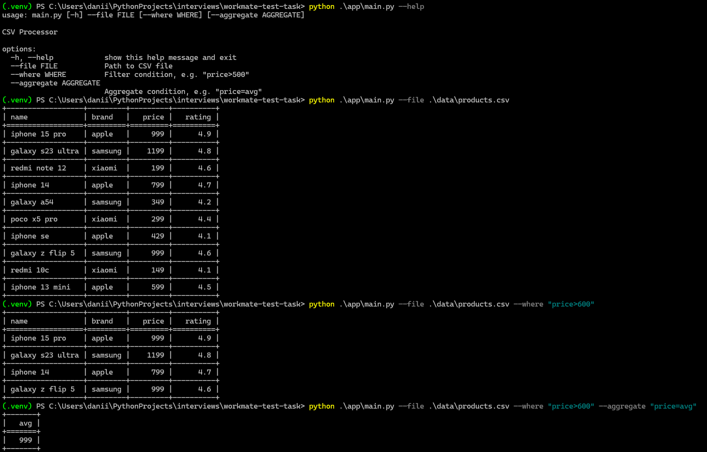

# CSV Processor

Утилита для фильтрации и агрегации данных из CSV-файла через командную строку.

## Установка

Создайте и активируйте виртуальное окружение:

```bash
python3 -m venv .venv
source .venv/bin/activate
```

Установите зависимости:

```bash
pip install -r requirements.txt
```

## Пример запуска


## Возможности

- Фильтрация по числовым полям (например, `price>100`)
- Агрегация (`avg`, `min`, `max`)
- Поддержка строковых значений как в CSV

## Тесты

Запуск тестов:

```bash
pytest
```

С покрытием:

```bash
coverage run -m pytest
coverage report -m
```

